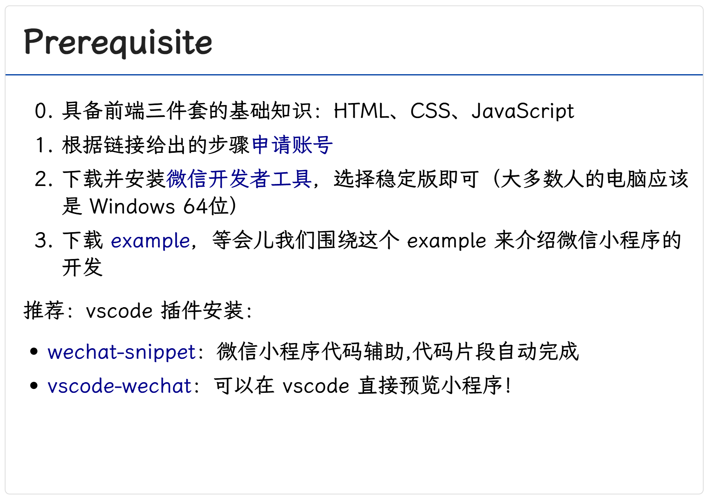

# Lec5-Wechat-Mini-Program-Basics

## 课前准备

请大家根据下面给出的图片，完成微信小程序账号的注册和微信开发者工具的下载安装。

    

链接：

- [申请账号](https://developers.weixin.qq.com/miniprogram/dev/framework/quickstart/getstart.html#%E7%94%B3%E8%AF%B7%E8%B4%A6%E5%8F%B7)
- [微信开发者工具](https://developers.weixin.qq.com/miniprogram/dev/devtools/download.html)
- example 就是仓库下的 example 目录

vscode 插件安装（也可直接在 vscode 扩展功能处搜索安装）

- [wechat-snippet](https://marketplace.visualstudio.com/items?itemName=ChandZhang.wechat-snippet)
- [vscode-wechat](https://marketplace.visualstudio.com/items?itemName=qinjia.vscode-wechat)
