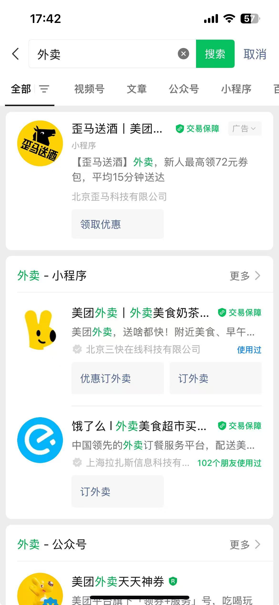
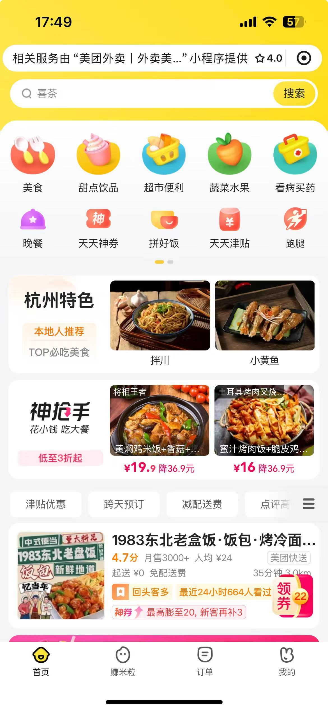
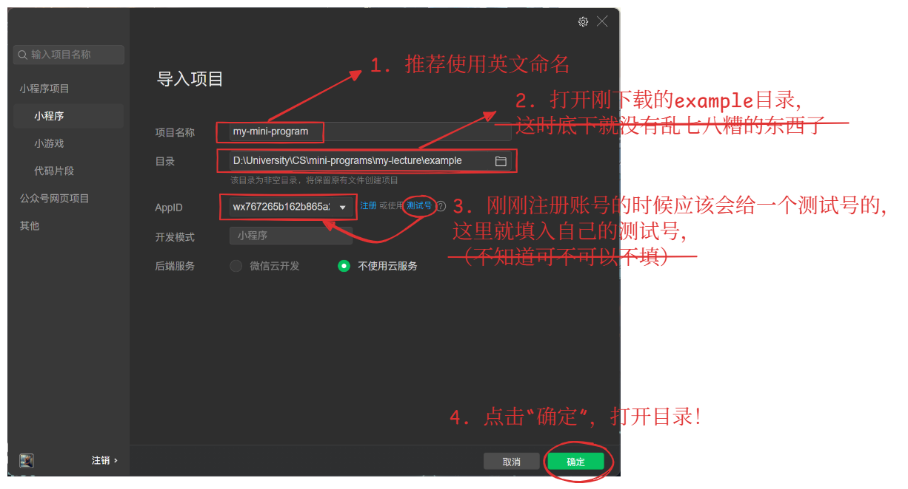
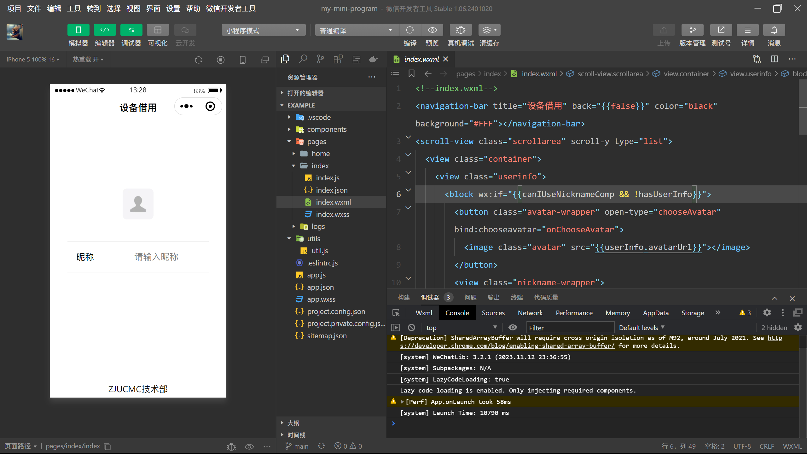
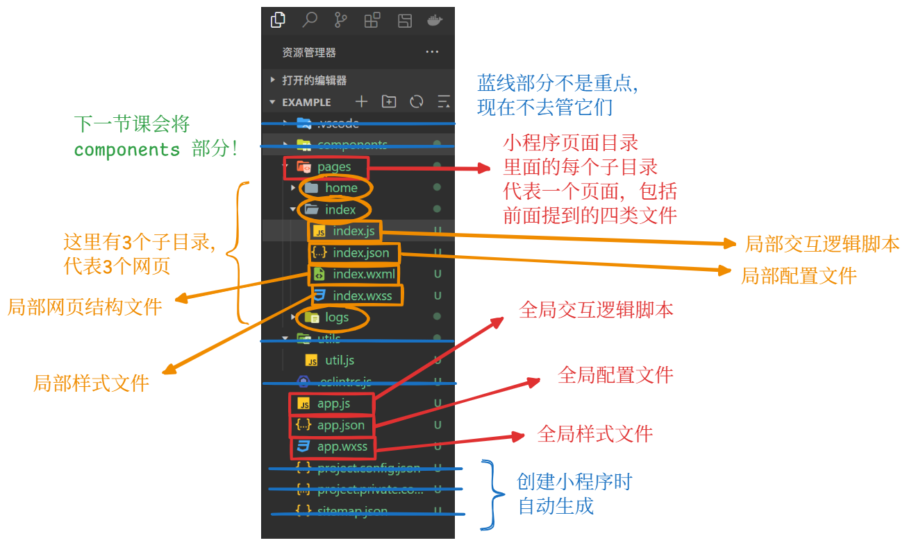

<div class="middle center title">
<div style="width: 100%">


# 初识微信小程序

技术部内训 Lec 5

<hr/>


Lecturer: 钱梓洋

Date: 2024/11/29


<!--s-->
<div class="middle center">
<div style="width: 100%">

# Part 1. 引入
<hr/>

<!--v-->
## What?

官方的定义（摘自[微信小程序文档](https://developers.weixin.qq.com/miniprogram/dev/framework/quickstart/#%E5%B0%8F%E7%A8%8B%E5%BA%8F%E7%AE%80%E4%BB%8B)）：

>小程序是一种全新的连接**用户**与**服务**的方式，它可以在**微信内**被便捷地获取和传播，同时具有出色的使用体验。

<div class="fragment">

更直接的理解：

>小程序可以视为**只能用微信打开和浏览的网站**(by 阮一峰)

</div>

<!--v-->
## Why?

我们为何使用微信小程序——下面来看个例子：

<div class="mul-cols">
<div class="col fragment">

- 某天，你心血来潮，打算中午吃外卖，顺便再买杯咖啡提提神。
    - 如果没有微信小程序的话，你可能要到手机的应用商店里下载某团之类的app。如果人在外面只能用流量下载，或者手机存储空间不够，那么这会带来一点点困扰

</div>

<div class="col fragment">

- 但好在，你的手机里安装了微信。打开微信，在首页搜索“外卖”，映入眼帘的便是和外卖相关的小程序

<div style="text-align: center; margin-top: 0px">
    
    
</div>

</div>
</div>


<!--v-->
## Comparison

- 微信小程序 vs. 网页
    - 微信小程序：更加轻量化、封装化的开发，并且具有更强的平台集成性（all in 微信开发者工具 & 微信）
        - 实际上，微信小程序是一种只能在微信上运行的网页
    - 网页：更加灵活，可以在不同的平台和浏览器上运行，但需要考虑更多的兼容性和安全性问题


<!--v-->
## Comparison

- 微信小程序 vs. App
    - 微信小程序：
        - 用户角度：具有轻量化、快速启动的特点，适合快速浏览和使用（比如填写各种表格等）
        - 开发者角度：使用HTML、CSS和JavaScript进行开发（~~更适合萌新开发者体质~~），无需考虑各种平台（安卓、iOS等）之间的差异
    - App：
        - 用户角度：提供更丰富的功能和更高的性能，可以实现更复杂的交互和界面效果
        - 开发者角度：通常使用原生开发语言，如Swift（iOS）和Java/Kotlin（Android），或者使用跨平台框架，如React Native、Flutter等

<!--v-->
## Prerequisite

0. 具备前端三件套的基础知识：HTML、CSS、JavaScript
1. 根据链接给出的步骤[申请账号](https://developers.weixin.qq.com/miniprogram/dev/framework/quickstart/getstart.html#%E7%94%B3%E8%AF%B7%E8%B4%A6%E5%8F%B7)
2. 下载并安装[微信开发者工具](https://developers.weixin.qq.com/miniprogram/dev/devtools/download.html)，选择稳定版即可（大多数人的电脑应该是 Windows 64位）
3. 下载 [example](https://github.com/NoughtQ/Lec5-Wechat-Mini-Program-Basics)，等会儿我们围绕这个 example 来介绍微信小程序的开发

推荐：vscode 插件安装：

- [wechat-snippet](https://marketplace.visualstudio.com/items?itemName=ChandZhang.wechat-snippet)：微信小程序代码辅助,代码片段自动完成
- [vscode-wechat](https://marketplace.visualstudio.com/items?itemName=qinjia.vscode-wechat)：可以在 vscode 直接预览小程序！


<!--s-->
<div class="middle center">
<div style="width: 100%">

# Part 2. 初识微信开发者工具
<hr/>

<!--v-->
## 新建项目

<div style="text-align: center; margin-top: 0px">
    
</div>

<!--v-->
## 微信开发者工具

<div style="text-align: center; margin-top: -25px; margin-bottom: -30px">
    
</div>


~~似曾相识的感觉，是不是在哪里见过这种 UI~~

<!--v-->
## 微信开发者工具

- 可以使用 **vscode** 敲代码，配合前面提到的插件，体验更佳！但还是推荐初学者在微信开发者工具上敲代码，因为它自带语法补充和检查。
- 小程序的编译和调试还是推荐在**微信开发者工具**中进行~

<!--v-->
## 文件类型

微信小程序在原有前端文件格式的基础上做了一些魔改，大家可以对照着看看：

- HTML 文件：`.html` -> `.wxml`
- CSS 文件：`.css` -> `.wxss`
- JS 文件：`.js` -> `.js`
    - 虽然后缀名没有变，但是微信小程序在原有JS的基础上新增了一些功能
    - 同时，小程序框架的逻辑层并非运行在浏览器中，因此 JS 在 web 中一些能力都无法使用，如 `window`，`document` 等。


<div class="fragment">

<span style="color: red">提问：回顾前端知识，简单谈谈这些文件的功能和作用？</span>

</div>


<div class="fragment">

- HTML：网页の结构与框架

</div>

<div class="fragment">

- CSS：网页の样式（~~让网页变得花里胡哨~~）

</div>

<div class="fragment">

- JS：网页の交互逻辑

</div>


<!--v-->
## 文件目录

<div style="text-align: center; margin-top: -10px">
    
</div>

<!--v-->
## 文件功能详述

<div class="fragment">

- `.wxml` 文件：定义页面的结构/框架/模板/布局，可以使用**小程序的模板语法**，如数据绑定、条件判断、循环等来生成页面的 HTML 结构

</div>
<div class="fragment">

- `.wxss` 文件：几乎同 `.css` 文件，故不再赘述

</div>
<div class="fragment">

- `.js` 文件：在小程序中用于处理整个小程序/单个页面的生命周期函数（比如`onLaunch()`、`onLoad()`、`onShow()`等），数据与方法等

</div>
<div class="fragment">

- `.json` 文件：作用类似 `.wxss` 文件，用于配置页面的属性和样式，比如页面标题、窗口样式、导航栏样式等
    - 在`app.json`文件（**全局配置**）中，它还可以控制页面的**路由**(route)（包括配置页面路径和切换方式等）

</div>

<div class="fragment">

<span style="color: red">提问：如何新增一个页面呢？</span>

</div>


<!--v-->
## JSON 文件概述

全名：JavaScript Object Notation

可以把它视为一个具有多个**键值对**(key-value pair)的**对象**（看起来类似 Python 的字典），有以下的一些规定：

- **属性**（键）：一定是一个用**双引号**包起来的**字符串**
- **值**：数值、字符串、布尔值、数组，甚至也可以是个 JSON 对象
- **对象**：外面一定要用一个花括号包起来

注意：JSON文件内<span style="color: red">不允许</span>有注释！

Learn more?

- [Wikipedia](https://zh.wikipedia.org/wiki/JSON)
- [现代 JavaScript 教程](https://zh.javascript.info/json)

<!--v-->
## 一个简单的 JSON 文件

```json
{
  "squadName": "Super hero squad",
  "formed": 2016,
  "active": true,
  "members": [
    {
      "name": "Molecule Man",
      "age": 29,
    },
    {
      "name": "Madame Uppercut",
      "age": 39,
    },
  ]
}
```

<!--v-->
## app.json

```json
{
  // 为了节省空间，我就以注释的形式标注这些属性，实际使用时千万不要留注释！
  // 其余未展示的属性均为选填  
  "pages": [  // page 属性（必填），其值为字符串数组
    "pages/index/index",
  ],
  "window": {  // window 属性（选填），其值为 JSON 对象
    "navigationBarTextStyle": "black",
    "navigationStyle": "custom"
  },
  // sitemapLocation 属性（必填），其值为字符串（自动生成）
  "sitemapLocation": "sitemap.json",   
}
```

<div class="fragment">

- `page` 属性：构成小程序的所有网页路径（无需写文件后缀名）

</div>
<div class="fragment">

- `window` 属性：设置小程序的状态栏、导航条、标题、窗口背景色等 

</div>
<div class="fragment">

Learn more: [微信小程序开发文档——全局配置](https://developers.weixin.qq.com/miniprogram/dev/reference/configuration/app.html)

</div>

<!--s-->
<div class="middle center">
<div style="width: 100%">

# Part 3. 微信小程序的特殊语法
<hr/>

<!--v-->
## Warmup

在学习基本语法前，不妨先实操一下之前学过的前端知识

看我演示！

<!--v-->
## WXML

WXML 文件在 HTML 文件的基础上增加了以下的功能：

- **数据绑定**
- **条件渲染**
- **列表渲染**
- 模板
- 引用

下面介绍加粗部分的内容~

<div class="fragment">

预备知识：

- `<view>` 标签：类似 HTML 的 `<div>` 标签，用于区分其他的区块，~~应该~~没有什么特殊意义

</div>

<!--v-->
## 数据绑定

所谓"数据绑定"，指的是(**JS**)脚本里面的某些数据，会自动成为(**WXML**)页面可以读取的**全局变量**，两者会**同步变动**。也就是说，脚本里面修改这个变量的值，页面会随之变化；反过来，页面上修改了这段内容，对应的脚本变量也会随之变化。这也叫做 MVVM 模式。——by 阮一峰

<div class="fragment">

- 对于网页内的JS文件，
    - 对于一般内容，就像编写正常的JS文件一样
    - 若是**微信小程序特有的内容**，则需要 `Page({...})` 包裹起来的，其中花括号及其内部是一个**类似** JSON 的对象，里面包含了与该网页相关的**属性**（不用双引号包起来）和**方法**。
- 数据绑定中的“数据”，指的是其中的 `data` 属性，它也是一个类似 JSON 的对象，里面包含了各种**变量**（属性）及其对应的值。
- 在 WXML 文件中，可以直接使用这些变量，但要用两层花括号（形如 `{{ var }}`）包起来（类似 Python 的 Jinja）

</div>

<!--v-->
## 数据绑定

我们能用这些数据做什么呢？

- 显示内容（已展示过）
- 组件属性
- 控制属性（后面介绍的列表渲染和条件渲染会用到这一点）
- 关键字（`true`，`false`）

上面这三者都需要在双花括号外<span style="color: red">额外包一层双引号</span>！

- 甚至可以完成一些简单的运算：算术运算、逻辑运算、三目运算、字符串运算、数据路径运算
- 还可以用来构造数组、对象等更复杂的变量

<div class="fragment">

我们还可以在网页上使用全局变量（需要用到 `getApp()` 函数）

</div>
<div class="fragment">

[更多 ~~花里胡哨的~~ 操作](https://developers.weixin.qq.com/miniprogram/dev/reference/wxml/data.html)

</div>

<!--v-->
## 列表渲染

关键语法：`wx:for`（作为 `<view>` 或 `<block>` 标签的属性）

- 在组件上使用 `wx:for` **控制属性**绑定一个**数组**，即可使用数组中各项的数据重复渲染该组件。
- 默认数组的当前项的**索引**默认为 `index`，数组当前项的**变量名**默认为 `item`

```html
<view wx:for="{{array}}">
  {{index}}: {{item}}
</view>
```

- 我们也可以自定义索引名（`wx:for-index`）和变量名（`wx:for-item`）（其值为字符串）
- `wx:for` 也可以嵌套

Learn more: [微信小程序开发文档](https://developers.weixin.qq.com/miniprogram/dev/reference/wxml/list.html)

<!--v-->
## 条件渲染

关键语法：（同样作为 `<view>` 或 `<block>` 标签的属性）
 
- `wx:if` -> `if`
- `wx:elif` -> `else if`
- `wx:else` -> `else`

格式：

```html
<view wx:if="{{condition1}}"> case 1 </view>
<view wx:elif="{{condition2}}"> case 2 </view>
<view wx:else> case 3 </view>
```

<!--v-->
## JS

微信小程序的JS增加了什么功能呢？

- 增加 `App` 和 `Page` 方法，进行**程序注册**和**页面注册**
    - 增加 `getApp` 和 `getCurrentPages` 方法，分别用来获取 App 实例（全局变量）和当前页面栈
- 提供模块化能力，每个页面有独立的作用域
- 提供丰富的 API，如微信用户数据，扫一扫，支付等微信特有能力（不讲）


<!--v-->
## 程序注册&页面注册

人话：**创建**(create)整个**小程序**（全局）及其**子页面**（局部）。

<div class="mul-cols" style="margin-top: -30px">
<div class="col fragment">

```js
// app.js
App({
  onLaunch (options) {
    // Do something initial when 
    // launch.
  },
  onShow (options) {
    // Do something when show.
  },
  onHide () {
    // Do something when hide.
  },
  onError (msg) {
    console.log(msg)
  },
  globalData: 'I am global data'
})
```

</div>
<div class="col fragment">

```js
//index.js
Page({
  data: {  // 数据
    text: "This is page data."
  },
  // 生命周期回调函数
  onLoad: function(options) {
    // 页面创建时执行
  }, 
  viewTap: function() {  // 事件响应函数
    this.setData({
      text: 'Set some data.'
    }, function() {
      // this is setData callback
    })
  },
})
```

</div>

<!--v-->
## 事件(Events)

这里主要讲的是与微信小程序相关的事件，对原生JS的事件的介绍可以参考一下我的[笔记](https://note.noughtq.top/web/frontend/js/browser#_4)。

小程序的常见事件有：

- `tap`：触摸后马上离开
- `longpress`：触摸后，超过 350ms 再离开。如果指定了该事件的回调函数并触发了该事件，tap事件将不被触发
- `touchstart`：触摸开始
- `touchmove`：触摸后移动
- `touchcancel`：触摸动作被打断，如来电提醒，弹窗等
- `touchend`：触摸结束

[更多事件](https://developers.weixin.qq.com/miniprogram/dev/framework/view/wxml/event.html)

<!--v-->
## 事件（续）

上面这些事件，在传播上分成两个阶段：

- **捕获(capture)阶段**：由上层元素向下层元素传播
- **冒泡(bubble)阶段**：由下层元素向上层元素传播

所以，同一个事件在同一个元素上面其实会**触发两次**：捕获阶段一次，冒泡阶段一次。

<!--v-->
## 回调函数(Callbacks)

小程序允许页面元素通过属性指定各种事件的**回调函数**，并且还能够指定是哪个阶段触发回调函数。具体方法是为事件属性名加上不同的前缀。小程序提供了以下四种前缀：

- `capture-bind`：捕获阶段触发
- `capture-catch`：捕获阶段触发，并中断事件，不再向下传播，即中断捕获阶段，并取消随后的冒泡阶段 
- `bind`：冒泡阶段触发
- `catch`：冒泡阶段触发，并取消事件进一步向上冒泡

<u>“回调函数前缀+事件”</u>的各种排列组合构成了 WXML 中用于处理事件的一个**属性**，它的值便是 JS 中回调**函数的名称**（字符串）。

下面来看我的演示！

<!--v-->
## Details

- 事件回调函数的参数是事件对象`event`，可以从它上面获取事件信息，比如事件类型、发生时间、发生节点、当前节点等
  - 但在演示中并没有用到`event`
- 事件回调函数内部的`this`，指向页面实例
- 页面实例的`this.setData()`方法，可以更改配置对象的`data`属性，进而通过数据绑定机制，导致页面上的全局变量发生变化
  - 注意：不能直接用赋值语句修改`this.data`！

这里体现了**面向对象编程**(Object-Oriented Programming)的思想。

<!--v-->
## 多页面的跳转

这里给出两种方法：

- `<navigator>` 标签配合 `url` 属性

```html
<navigator url="../page/page">content</navigator>
```

- `wx.navigateTo()` 方法
  - 一种实现方法：在`<button>`上使用事件处理程序（`bindtap`），然后在 JS 文件中让该事件处理程序调用 `wx.navigateTo()` 方法，方法内的 `url` 属性指定跳转的子页面地址


<!--v-->
## 其他有趣的小组件

这里就简单过一下，具体的内容见微信小程序下一讲。

- 动态提示 `Toast`
  - 方法：`wx.showToast()`展示微信内置的动态提示框。它的参数对象为：
    - `title`属性：指定提示内容
    - `duration`属性：指定提示框的展示时间（单位：毫秒）

<!--v-->
## 其他有趣的小组件（续）

- 对话框 `Modal`
  - 方法：`wx.showModal()`显示一个对话框，用户可以选择"确定"或"取消"。它的参数对象为：
    - `title`属性：表示对话框的标题
    - `content`属性：表示对话框的内容
    - `success`属性：指定对话框成功显示后的回调函数
    - `fail`属性：指定显示失败时的回调函数

<!--s-->
<div class="middle center">
<div style="width: 100%">

# Part 4. 总结
<hr/>

<!--v-->
## 今天我们学了啥(⊙_⊙)?

<div class="fragment">

- 了解微信小程序的基本概念

</div>
<div class="fragment">

- 微信开发者工具的简单使用

</div>
<div class="fragment">

- 微信小程序的各类文件及其文件结构
    - `.wxml`
    - `.wxss`
    - `.js`
    - `.json`

</div>
<div class="fragment">

- 掌握一些微信小程序特有的基本语法

</div>
<div class="fragment">

Learn more?

- [微信小程序开发文档](https://developers.weixin.qq.com/miniprogram/dev/framework/)：~~个人认为写得有点烂，不太适合新手上门~~
- [阮神的微信小程序入门教程](https://www.ruanyifeng.com/blog/2020/10/wechat-miniprogram-tutorial-part-one.html)：墙裂安利！
 
</div>


<!--v-->
## 最后的碎碎念

下面我想讲的内容和今天的主题没什么关系，但我希望任何一位对（泛）CS方向感兴趣的同学能够在课后抽些时间阅读这些材料（可能你们从其他学长那边听说过了），我相信这对各位的CS素养的提升产生不小的帮助！

<div class="fragment">

- [xg 的「实用技能拾遗」系列辅学课程](https://slides.tonycrane.cc/PracticalSkillsTutorial/)：CS 技能 Get!
    - 至少要把 23 秋冬学期的 [lec0](https://slides.tonycrane.cc/PracticalSkillsTutorial/2023-fall-ckc/lec0) 给看完~
    - 今天讲课用的课件[模板](https://github.com/TonyCrane/slide-template)就是 xg 做的，给 xg 膜一个 orz
- [The Missing Semester](https://missing-semester-cn.github.io/)：MIT开设的课程，相比校内开的课程讲得更深入
- [大Q老师的《谈谈如何让自己看上去、闻上去都像一个CS人》](https://www.cc98.org/topic/5370849)：值得反复诵读的经典 orz
- [提问的智慧](https://github.com/ryanhanwu/How-To-Ask-Questions-The-Smart-Way/blob/main/README-zh_CN.md)：CS 人应该掌握的沟通技巧

</div>

<!--v-->
## 最最最后附上一些有用资料

- [ZJU 笔记大全](https://isshikihugh.github.io/zju-cs-asio/)：可能是你期末周补天的救命稻草
    - ~~里面有我的笔记~~

- [图灵班学习指南](https://zju-turing.github.io/TuringCourses/)：里面的学习经验即使对非图灵班同学也很有用！

- [浙江大学课程攻略分享计划](https://github.com/QSCTech/zju-icicles)：包含了几乎所有专业大多数课程的资料！  
    - 虽然ZJU是最早一批发起这一项目的学校，但是现在维护状况堪忧，里面的资料过于陈旧，最新资料还是去98或者别的学长学姐的仓库里翻吧


<!--s-->
<div class="middle center title">
<div style="width: 100%">

# Thanks for Watching!

<hr/>

Any Questions?